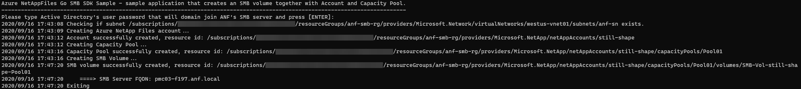

# Azure NetAppFiles SMB SDK Sample for Go

This project demonstrates how to create SMB volumes using Microsoft.NetApp resource provider Go SDK.

In this sample application we perform the following operations:

* Creation
  * NetApp Files Account
  * Capacity Pool
  * SMB Volume
* Deletions (when cleanup variable is set to true)
  * Volume
  * Capacity Pool
  * Account

If you don't already have a Microsoft Azure subscription, you can get a FREE trial account [here](http://go.microsoft.com/fwlink/?LinkId=330212).

## Prerequisites

1. Go installed \(if not installed yet, follow the [official instructions](https://golang.org/dl/)\)
3. Azure Subscription
4. Subscription needs to be whitelisted for Azure NetApp Files. For more information, please refer to [this](https://docs.microsoft.com/azure/azure-netapp-files/azure-netapp-files-register#waitlist) document.
5. Resource Group created
6. Virtual Network with a delegated subnet to Microsoft.Netapp/volumes resource. For more information, please refer to [Guidelines for Azure NetApp Files network planning](https://docs.microsoft.com/en-us/azure/azure-netapp-files/azure-netapp-files-network-topologies)
7. Adjust variable contents within `var()` block at `example.go` file to match your environment
8. For this sample Go console application work, we need to authenticate and the chosen method for this sample is using service principals.
   1. Within an [Azure Cloud Shell](https://docs.microsoft.com/en-us/azure/cloud-shell/quickstart) session, make sure you're logged on at the subscription where you want to be associated with the service principal by default:
            ```bash
            az account show
           ```
             If this is not the correct subscription, use             
             ```bash
            az account set -s <subscription name or id>  
            ```
        1. Create a service principal using Azure CLI
            ```bash
            az ad sp create-for-rbac --sdk-auth
            ```

            >Note: this command will automatically assign RBAC contributor role to the service principal at subscription level, you can narrow down the scope to the specific resource group where your tests will create the resources.

        2. Copy the output content and paste it in a file called azureauth.json and secure it with file system permissions
        3. Set an environment variable pointing to the file path you just created, here is an example with Powershell and bash:
            Powershell 
            ```powershell
           [Environment]::SetEnvironmentVariable("AZURE_AUTH_LOCATION", "C:\sdksample\azureauth.json", "User")
            ```
            Bash
            ```bash
           export AZURE_AUTH_LOCATION=/sdksamples/azureauth.json
           ``` 

        >Note: for other Azure Active Directory authentication methods for Go, please refer to [Authentication methods in the Azure SDK for Go](https://docs.microsoft.com/en-us/azure/go/azure-sdk-go-authorization). 

## What is example.go doing

Currently, Azure NetApp Files SDK exposes control plane management operations, CRUD operations for its resources like accounts, capacity pools, volumes and snapshots. We start this execution by defining some basic variables that will be used throughout the code to define resource group name, location, account name, virtual network, subnet names, etc.

>Note: Please refer to [Resource limits for Azure NetApp Files](https://docs.microsoft.com/en-us/azure/azure-netapp-files/azure-netapp-files-resource-limits) to understand ANF's most current limits.

Next, it will move forward and obtain some non-sensitive information from the *file-based authentication* file that is used at the initial stages to identify the subscription ID for the test we perform to check if the subnet provided exists before starting creating any ANF resource. Authentication is made on each operation where we obtain an authorizer to pass to each client we instantiate (in Azure Go SDK for NetAppFiles each resource has its own client). For more information about the authentication process used, refer to [Use file-based authentication](https://docs.microsoft.com/en-us/azure/go/azure-sdk-go-authorization#use-file-based-authentication) section of [Authentication methods in the Azure SDK for Go](https://docs.microsoft.com/en-us/azure/go/azure-sdk-go-authorization) document.

Then, it will start the CRUD operations by creating one account, then capacity pool, volumes, snapshot and volume from snapshot, in this exact sequence \(for more information about Azure NetApp Files storage hierarchy please refer to [this](https://docs.microsoft.com/en-us/azure/azure-netapp-files/azure-netapp-files-understand-storage-hierarchy) document\). After all resources are created, it will perform an update to a volume by changing its usage threshold (size) doubling its size in this example.

Finally, the clean up process takes place (not enabled by default, please change variable `shouldCleanUp` to `true` at `example.go` file if you want clean up to take place), deleting all resources in the reverse order following the hierarchy otherwise we can't remove resources that have nested resources still live. You will also notice that the clean up process uses a function called `WaitForNoANFResource`, at this moment this is required so we can workaround a current ARM behavior of reporting that the object was deleted when in fact its deletion is still in progress. We will also notice some functions called `GetAnf<resource type>`, these were also created in this sample to be able to get the name of the resource without its hierarchy represented in the `<resource type>.name` property, which cannot be used directly in other methods of Azure NetApp Files client like `get`.

## Contents

| File/folder                 | Description                                                                                                      |
|-----------------------------|------------------------------------------------------------------------------------------------------------------|
| `media\`                       | Folder that contains screenshots.                                                                                              |
| `src\`                       | Sample source code folder.                                                                                              |
| `src\example.go`            | Sample main file.                                                                                                |
| `src\go.mod`            |The go.mod file defines the module’s module path, which is also the import path used for the root directory, and its dependency requirements, which are the other modules needed for a successful build.|
| `src\go.sum`            | The go.sum file contains hashes for each of the modules and it's versions used in this sample|
| `src\internal\`       | Folder that contains all internal packages dedicated to this sample.                |
| `src\internal\iam\iam.go` | Package that allows us to get the `authorizer` object from Azure Active Directory by using the `NewAuthorizerFromFile` function. |
| `src\internal\models\models.go`       | Provides models for this sample, e.g. `AzureAuthInfo` models the authorization file.                   |
| `src\internal\sdkutils\sdkutils.go`       | Contains all functions that directly uses the SDK and some helper functions.                   |
| `src\internal\uri\uri.go`       | Provides various functions to parse resource IDs and get information or perform validations.                   |
| `src\internal\utils\utils.go`       | Provides generic functions.                   |
| `.gitignore`                | Define what to ignore at commit time.                                                                            |
| `CHANGELOG.md`              | List of changes to the sample.                                                                                   |
| `CONTRIBUTING.md`           | Guidelines for contributing to the sample.                                                                       |
| `README.md`                 | This README file.                                                                                                |
| `LICENSE`                   | The license for the sample.                                                                                      |
| `CODE_OF_CONDUCT.md`        | Microsoft's Open Source Code of Conduct.                                                                         |

## How to run

1. Go to your GOPATH folder and create the following path
    ```powershell
    # PowerShell example
    cd $env:GOPATH/src
    mkdir ./github.com/Azure-Samples
    ```

    ```bash
    # Bash example
    cd $GOPATH/src
    mkdir -p ./github.com/Azure-Samples
    ```
2. Clone it locally
    ```bash
    cd github.com/Azure-Samples
    git clone https://github.com/Azure-Samples/netappfiles-go-sdk-sample.git
    ```
3. Change folder to **netappfiles-go-sdk-sample/src**
    ```bash
    cd netappfiles-go-sdk-sample/src
    ```
4. Make sure you have the `azureauth.json` and its environment variable with the path to it defined (as previously described at [prerequisites](#Prerequisites))
6. Edit file **example.go** `var()` block and change the variables contents as appropriate (names are self-explanatory).
7. Run the sample
    ```bash
    go run .
    ```

Sample output


## References

* [Authentication methods in the Azure SDK for Go](https://docs.microsoft.com/en-us/azure/go/azure-sdk-go-authorization)
* [Azure SDK for Go Samples](https://github.com/Azure-Samples/azure-sdk-for-go-samples) - contains other resource types samples
* [Resource limits for Azure NetApp Files](https://docs.microsoft.com/en-us/azure/azure-netapp-files/azure-netapp-files-resource-limits)
* [Azure Cloud Shell](https://docs.microsoft.com/en-us/azure/cloud-shell/quickstart)
* [Azure NetApp Files documentation](https://docs.microsoft.com/en-us/azure/azure-netapp-files/)
* [Azure SDK for Go](https://github.com/Azure/azure-sdk-for-go) 
